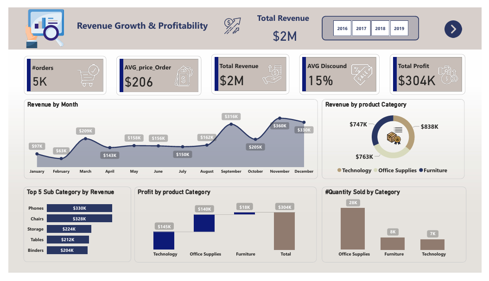
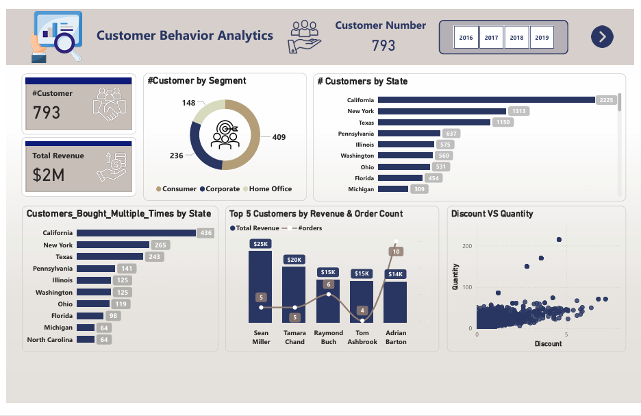
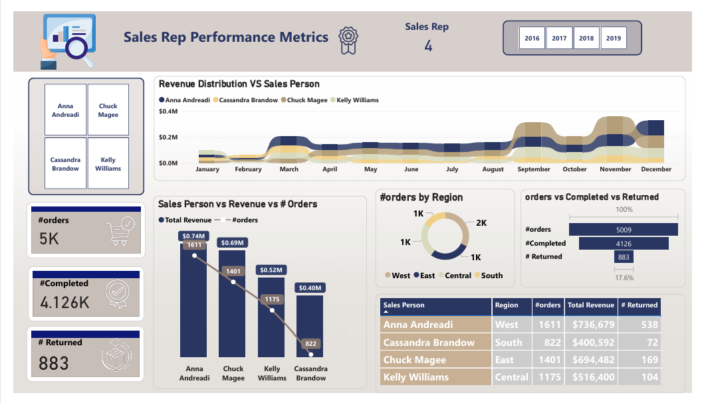

## 📊 Sample Superstore Sales Analysis Project

## Project Overview
This project focuses on analyzing the Sample Superstore retail dataset to uncover critical business insights. The analysis tracks sales performance, profitability, and customer demographics across various regions and product categories, providing a 360-degree view of the business health.

## Objectives
- Financial Tracking: Analyze Revenue ($2M) and Profit ($304K) trends over time.

- Product Performance: Identify top-performing categories (Technology, Office Supplies, Furniture) and sub-categories.

- Customer Segmentation: Understand the behavior of the 793 unique customers across different segments (Consumer, Corporate, Home Office).

- Logistics & Sales: Evaluate Sales Representative performance and monitor order return rates.

## Dashboard Screenshots

## Tools & Technologies
- Power BI: Data Modeling, Advanced DAX measures, and Interactive Visualization.

- Power Query: ETL processes (Data cleaning, type transformation, and merging).

- Microsoft Excel: Initial data exploration.

## Dataset Description
- The dataset includes retail transaction data with the following features:

- Order Details: Order date, Ship date, and Shipping mode.

- Financials: Sales, Profit, Discount, and Quantity sold.

- Geography: State, City, and Region (West, East, Central, South).

- Product Hierarchy: Category and Sub-category (Phones, Chairs, Storage, etc.).

- Sales Reps: Tracking performance for specific employees (e.g., Anna Andreadi, Chuck Magee).

## Data Processing Steps
1. Cleaning: Handled missing values and ensured correct data types for dates and currency.

2. Modeling: Created a star schema to link Sales data with Product and Customer dimensions.

3. DAX Measures: Developed measures for Total Revenue, Total Profit, Average Discount, and Return Rate.

4. Time Intelligence: Created dynamic charts to compare monthly growth from 2016 to 2019.

## Key Insights
- Top Revenue Drivers: The Technology category leads in revenue, with Phones and Chairs being the highest-selling sub-categories.

- Geographic Hotspots: California and New York are the leading states in both customer count and total revenue.

- Sales Efficiency: Identified top sales reps and analyzed the correlation between high discounts and quantity sold.

- Profitability: Despite high sales in some areas, certain categories show lower margins due to high average discounts.

# How To Use This Project
- Clone the repository.

- Navigate to the Dashboards/ folder.

- Open the .pbix file using Power BI Desktop.

- (Optional) Explore the raw data in the Data/ folder.

## Author
- Amr Osama Data Scientist | Power BI Developer

- LinkedIn: https://www.linkedin.com/in/amr-osama-el-sayed

- Portfolio: https://mostaql.com/u/Amr_Osama_EL/portfolio
